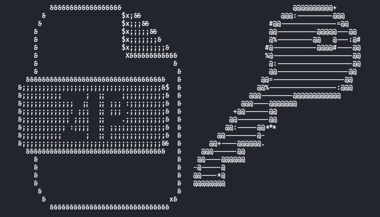

# ZIPFREAK - Advanced ZIP Password Utility



> **Ethical Password Recovery Toolkit** - Create secure ZIP archives or recover lost passwords with cutting-edge techniques.

## Features
- **AES-256 Encrypted ZIP** creation
- **Multi-mode Cracking Engine**:
  -  Dictionary attacks (with rockyou.txt fallback)
  -  Brute-force (configurable charset)
  -  Smart mask attacks
- Real-time password strength analysis
-  Colorized terminal interface

##  Installation
```bash
git clone https://github.com/B1tZ3r0/ZIPFREAK.git
cd ZIPFREAK
./install.sh
